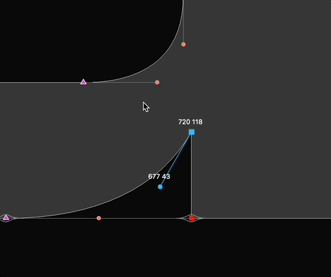
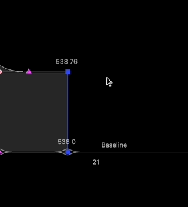
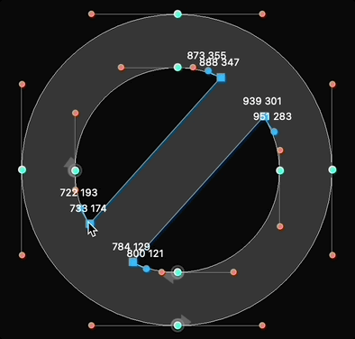
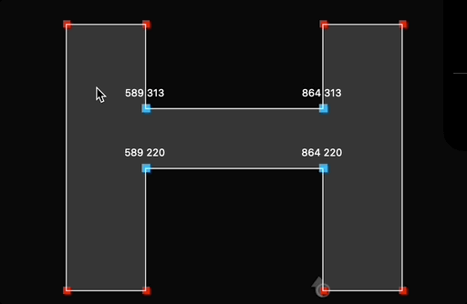
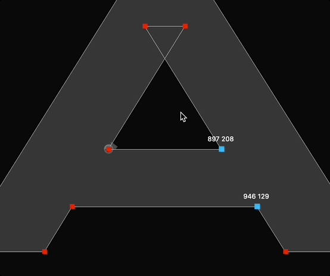

# Overlapper
#### Ryan Bugden
*Initially conceived and refined between 2022.03.18 and 2023.05.30.*

A RoboFont extension that gives you the power to add overlaps (+) and chamfers (-) to your glyph in a dynamic and high-fidelity way. The result is more editability when drawing, and more flexibility when interpolating.

## How to use Overlapper:

### Overlapping and chamferring:
1. Select at least one on-curve point, preferably on a sharp corner.
2. Hold `v`, and move the mouse right or left to make your corner into an overlap or a chamfer, respectively. The further you move your mouse, the bigger the overlap or chamfer. 
3. Let go of `v` to commit the resulting shape.

### Cross-overlapping:
1. Select 2 or 4 on-curve points (Doesn't currently work on more).
2. Hold `Shift + v`, and move the mouse right or left to make your corner into an overlap or a chamfer, respectively. The further you move your mouse, the bigger the cross-overlap. 
3. Let go of `v` (before letting go of `Shift`) to commit the resulting shape.

*Note: You can change hotkey in Extensions > Overlapper > Settings...*

---    

#### Notes:
- If your glyph has contours with start points that are off-curves, this will make the nearest on-curve the start point in the process. This is the current workaround to preventing Overlapper from crashing RoboFont.
- In cross-overlap mode, when selecting more than 2 points, Overlapper does its best to pair them up. If it's not doing what you want it to do, try to do it on one pair at a time.
 
---
Overlapper is inspired by the [Add Overlap](https://github.com/asaumierdemers/AddOverlap) extension by Alexandre Saumier Demers. The cross-overlap feature is inspired by Thom Janssen’s [Cross Overlap](https://github.com/thomgb/RF-Extensions).

Special thanks to Frank Grießhammer, Jackson Cavanaugh, Andy Clymer, and all of the minds behind [fontTools](https://github.com/fonttools/fonttools) (the reason the curve extrapolation is so accurate).
